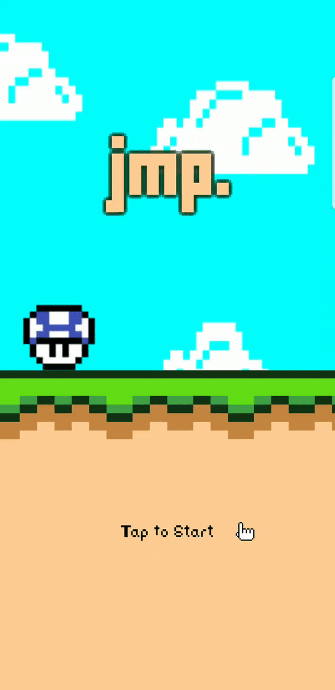
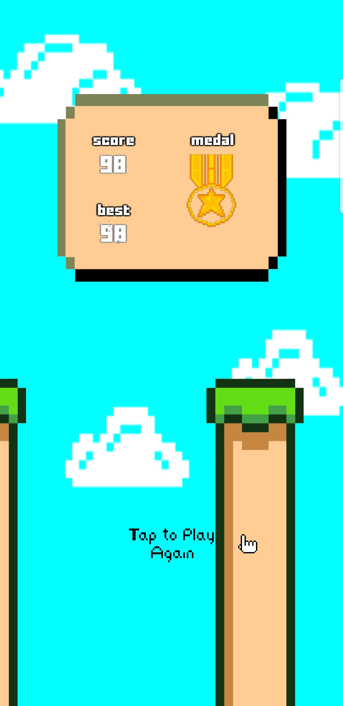

# **jmp**
A small project where I created a simple 2D, infinite-scrolling jumping game made with Unity.  
Controls: Tap to jump, Tap & Hold to jump longer.  
This project was intended for learning the Unity Engine and deploying applications to the Play Store.  
*All assets were designed and created by me*

## **Preview**

  
   
  

## **Download**
Android APK file can be downloaded [here](https://github.com/Kurt-Tito/jmp/raw/master/jmp.apk)  
and also available via the [Play Store](https://play.google.com/store/apps/details?id=com.desusite.jmp&hl=en_US)

### **To Do**
1. Update jump height
2. Code refactoring and re-organize assets
